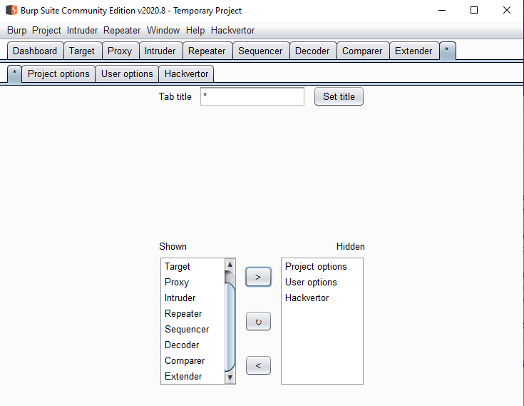

# Wildcart_2

If you use a lot of burp extensions surely the Tab UI becomes crowded. This extension is for you. I've rewrited from scratch the original [burp-wildcard](https://github.com/hvqzao/burp-wildcard) extension so it lets you choose which tabs you want to hide. The result can be seen in the following capture:



When added to the extensions it is recommended to set it at the bottom of the list in order for this extension to be the last one that loads.

## Debugging and improving the extension

### Build

It is a gradle project so therefore it should be easy to build in any IDE. Forms were created using IntelliJ GUI Designer and so it requires the gradle plugin to generate the initialization code for the forms.

### Run

There's a non-well known burp feature that allows any user to fast reload an extension by doing ctrl+click in the extender checkbox which is helpful if - like me - you enjoy trial and error programming

### How does it work?

Well, it is a matter of knowing who the parent of your Component is


When you register a Tab in a burp extension the parent is the Burp's JTabbedPane so with a reference to it you can register, unregister and move tabs as you want. The following code is an example that uses this feature:

``java
    ArrayList<String> tabs = new ArrayList<String>();

    JTabbedPane parent = (JTabbedPane) tabbedPane.getParent();

    if (parent!=null) {
        for (int i = 0; i < parent.getTabCount(); i++) {
            String tabName = null;
            try {
                tabName = parent.getTitleAt(i);
                if (!tabName.equals(Settings.tab_title)) {
                    tabs.add(tabName);
                }
            } catch (Exception ex) {
                // do nothing
            }
        }

        return tabs;
    } else {
        BurpExtender.getInstance().stdout("Parent is null");
        return null;
    }
```

## TODO

1. There are weird bugs with tab renaming
2. The UI could be dramatically improved to match Burp's guidelines
3. Perhaps some kind of sorting persistence could be added
4. Drag and drop will be amazing
5. Improve code quality
6. Do further researcg about extension loading order and automatic refresh of tabs